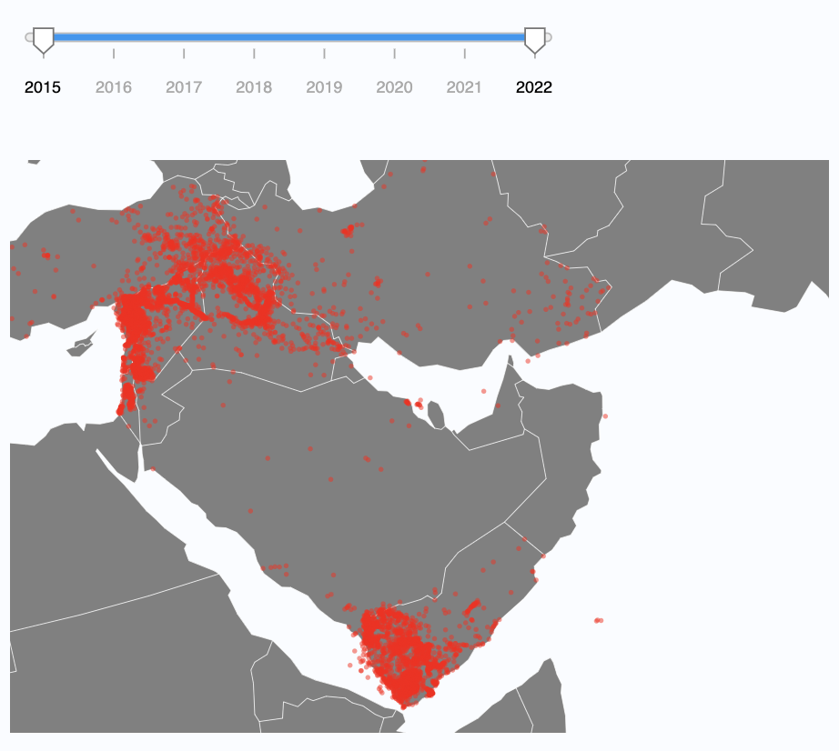
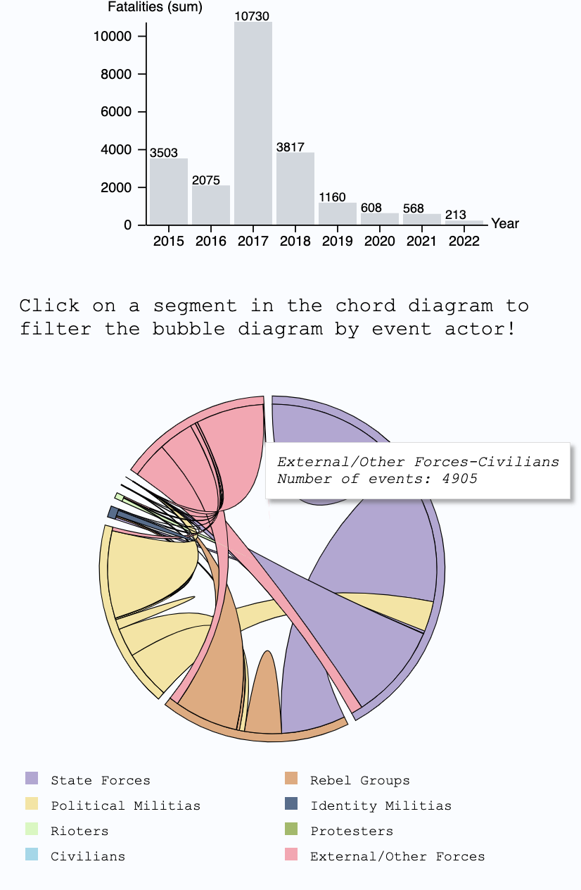
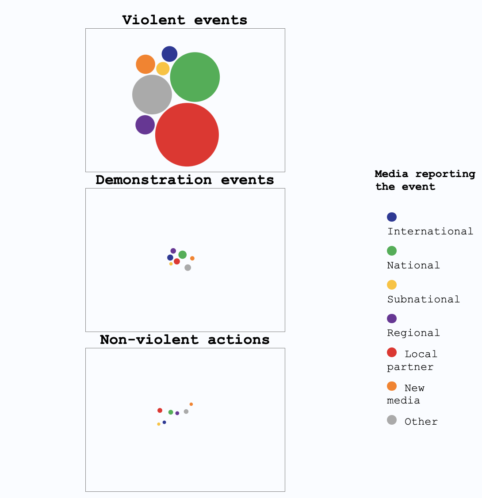

Timeline: Mar-Apr 2022

In this project, my [CPSC 436v](https://www.students.cs.ubc.ca/~cs-436v/22Jan/) teammates and I created a web-based visualization using [D3.js](https://d3js.org/). Our project uses the [ACLED dataset](https://acleddata.com/curated-data-files/) to visualize political violence events that happened in the Middle East between 2015-2022. Our visualization consists of three innovative views that we designed and implemented:

- A dot density map combined with a timeline that shows the number of events that happened in each country in a given year
  

- A chord diagram combined with a bar chart that shows the amount of interaction between two given actors involved in a political violence event, and the number of fatalities by year
  

- A bubble diagram that associates the type of event with the scale of the event
  
