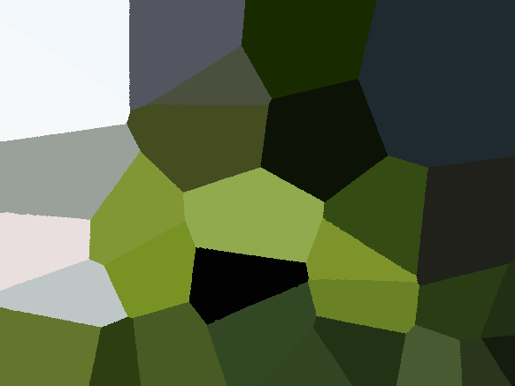

Timeline: Oct 2019

I did this project for [UBC's CPSC 221 course](https://courses.students.ubc.ca/cs/courseschedule?pname=subjarea&tname=subj-course&dept=CPSC&course=221). The detailed description of this project can be found [here](https://www.students.cs.ubc.ca/~cs-221/2019W1/mps/p2/), and my code for this project can be found [here](https://github.com/gokcedilek/Flood-Fill-using-BFS-DFS).

In this project, I implemented a [flood fill](https://en.wikipedia.org/wiki/Flood_fill) algorithm in C++ that performs [BFS](https://en.wikipedia.org/wiki/Breadth-first_search) and [DFS](https://en.wikipedia.org/wiki/Depth-first_search) traversal of coordinates in an image, starting from a randomly generated set of center coordinates.
The algorithm colors each coordinate visited in the image, either using BFS or DFS traversal, based on the color of its closest neighbouring center coordinate. I also implemented [function objects](https://en.wikipedia.org/wiki/Function_object#:~:text=In%20computer%20programming%2C%20a%20function,objects%20are%20often%20called%20functors.) to determine the color of each pixel, and stack, queue, and deque structures to store the pixels for the BFS and DFS fills. The end result is the same image filled with different patterns (using the different function objects), and using BFS or DFS traversals. Check out how different the BFS and DFS fills of the same original image look, and see if you can make sense of why they look the way they do!:)

BFS fill:

DFS fill:

