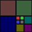
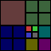
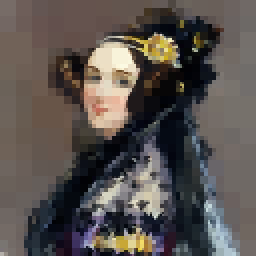

Timeline: Nov 2019

I did this project for [UBC's CPSC 221 course](https://courses.students.ubc.ca/cs/courseschedule?pname=subjarea&tname=subj-course&dept=CPSC&course=221). The detailed description of this project can be found [here](https://www.students.cs.ubc.ca/~cs-221/2019W1/mps/p3/), and my code for this project can be found [here](https://github.com/gokcedilek/Self-Balancing-Quadtree-for-Image-Compression).

In this project, I implemented an image compression technique written in C++, such that the output image has reduced color detail in areas that do not contain much color variability in the original image, but maintains detail in areas containing lots of variability in the original image.

I implemented a quadtree data structure to represent an image, which is a [tree](<https://en.wikipedia.org/wiki/Tree_(data_structure)>) where each node has 0 or 4 children. Each node of the tree represents a group of pixels in an image. The quadtree splits its leaf nodes to decrease the color variability across its leaf nodes. Each node holds the average color of the pixels in the node, and the "variability" measure is the sum of the variance of these pixels from the average.
I implemented recursive algorithms to split the node with the highest color variance among its pixels into children nodes, using a priority queue, until a given parameter representing the maximum number of leaf nodes the tree can have, the "leaf bound", is reached.
I implemented two different versions of this recursive splitting algorithm; one which performs splits to produce a (possibly) imbalanced quadtree, and one that produces a [self-balancing tree](https://en.wikipedia.org/wiki/Self-balancing_binary_search_tree). The splits might incur imbalance between the heights of the subtrees; that is, similar to an [AVL Tree](https://en.wikipedia.org/wiki/AVL_tree), the tree would be considered "unbalanced" when the height difference of its subtrees becomes greater than 2. The self-balancing quadtree possibly incurs additional neighboring splits upon every required split, if the quadtree becomes imbalanced with this split.

This quadtree data structure is an application of image compression, since the tree selectively splits only the nodes with higher color variability than others in the original image, until a given bound is reached. Thus, the output image has reduced color detail in areas that did not contain much color variability, by representing them with smaller number of nodes, but maintains detail in areas that contained lots of variability, by representing them with greater number of nodes.

See if you can figure out which of these is the unbalanced tree, and the self-balancing tree!

How about now?:)

